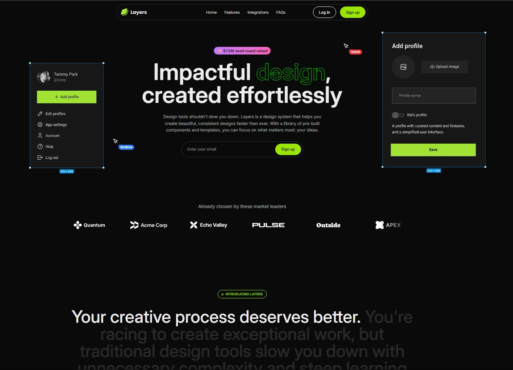

# 🧪 SaaS Landing Page — Diseño y Maquetación

Este proyecto es una landing page moderna para un producto SaaS, construida como ejercicio de práctica para mejorar mis habilidades en desarrollo web frontend. El diseño se inspira en interfaces limpias, atractivas y profesionales, con animaciones suaves e interacciones dinámicas.



## 🚀 Tech Stack

- **Next.js** – Framework React para renderizado híbrido y routing optimizado.
- **React** – Librería principal para construir la UI basada en componentes.
- **Tailwind CSS** – Utilizado para un diseño responsivo, rápido y elegante mediante clases utilitarias.
- **Framer Motion** – Librería para animaciones suaves y controladas en React.

## 🎯 Objetivo del Proyecto

- Mejorar mis habilidades en diseño UI/UX moderno y frontend.
- Aprender prácticas profesionales integrando tecnologías actuales.
- Reforzar el uso de Tailwind para layouts rápidos y mantenibles.
- Explorar animaciones con Framer Motion para mejorar la experiencia de usuario.

## 📂 Estructura del Proyecto

```
/app            → Estructura de páginas (Next.js App Router)
/components     → Componentes reutilizables como Navbar, Hero, Cards, etc.
/styles         → Estilos globales y personalizados
/src/assets     → Imágenes, íconos, SVGs
```

## 🎨 Funcionalidades del Diseño

- Layout responsivo para todas las resoluciones.
- Animaciones suaves al cargar, al hacer hover o al interactuar.
- Diseño oscuro con colores vivos para contraste y jerarquía visual.
- Componentes bien separados y reutilizables para escalabilidad.

## 🧠 Lo que aprendí

- Uso eficiente de `Tailwind CSS` para construir secciones complejas sin escribir CSS tradicional.
- Aplicación de animaciones con `Framer Motion` incluyendo `variants`, `transitions` y `layout`.
- Mejores prácticas en diseño web moderno con enfoque en experiencia de usuario.
